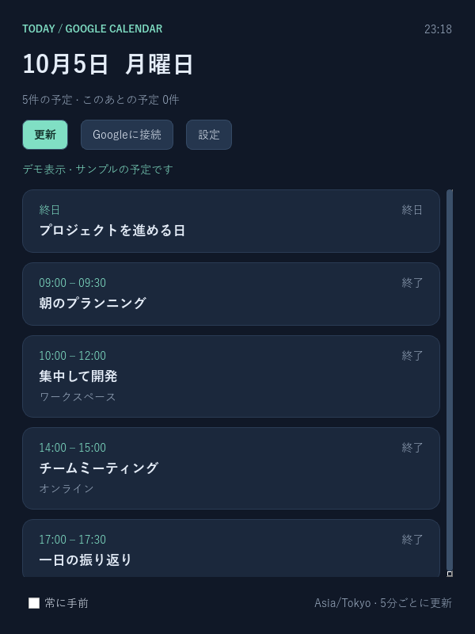

# Google Desktop Calendar

今日の Google カレンダーを表示する、Python / PySide6 のデスクトップアプリです。
ダークテーマの予定カード、終日・進行中・終了の表示、5分ごとの同期、日付切り替え、最前面固定に対応します。
Google Calendar APIへの操作は読み取り専用です。



## Windows版（Python・WSL不要）

GitHub Actions の **Windows EXE** ワークフローから
`GoogleDesktopCalendar-Windows-x64` をダウンロードして展開します。
`dist/GoogleDesktopCalendar.exe` をダブルクリックで起動できます。
単体exeにPythonとQtを同梱するため、初回の起動には展開時間がかかります。

デスクトップとスタートメニューに登録する場合は、展開したフォルダでPowerShellから実行します。

```powershell
powershell -ExecutionPolicy Bypass -File .\scripts\install_windows.ps1 -ExePath .\dist\GoogleDesktopCalendar.exe
```

Windowsへのログイン時にも起動したい場合は、末尾に `-AutoStart` を付けて登録します。
自動起動を解除する場合は、`Win+R` → `shell:startup` を開き、
`Google Desktop Calendar` のショートカットを削除してください。
通常の配置先は `%LOCALAPPDATA%\Programs\GoogleDesktopCalendar` です。
設定とGoogle認証はexeと分離してユーザー設定フォルダに保存されます。
既存のWindows認証を上書きせず、WSLから引き継ぐ場合のみインストールスクリプトの
`-CredentialSource` に既存の `token.json` を明示指定できます。

Windows上で自分でビルドする場合:

```powershell
uv sync --locked --dev --group build
uv run python scripts/build_windows.py
```

GitHub ActionsではWindows上のテストに加え、ビルドしたexeそのものを起動し、
WindowsのQt描画環境とデモ予定5件の表示を検査します。exeには認証情報を含めません。

## 開発環境

Python 3.12 と [uv](https://docs.astral.sh/uv/getting-started/installation/) を使います。
プロジェクト専用の `.venv` とコミット済み `uv.lock` で依存を管理します。

```bash
uv sync --locked --dev
uv run google-desktop-calendar --demo
```

デモはサンプル予定です。実際の予定を表示するには以下の認証を行ってください。
Linux / WSLg と Windows に対応します。macOSは実機検証未実施です。
WSLではWSLgなどのGUI表示環境が必要です。Qtの共有ライブラリが不足する場合、Ubuntuでは
`sudo apt install libegl1 libopengl0 libxcb-cursor0 libxkbcommon-x11-0` を実行します。
日本語フォントがないLinuxでは `fonts-noto-cjk` も導入してください。
WSLgでは日本語フォントがない場合にWindows側の游ゴシックを読み込みます（フォントのコピー・同梱は行いません）。

Linux / WSLg のアプリ一覧への登録:

```bash
uv run python scripts/install_desktop.py
```

「今日の予定」から起動できます。登録は現在のプロジェクトの `.venv` を参照するため、
フォルダを移動した場合は再登録してください。削除する場合は
`~/.local/share/applications/google-desktop-calendar.desktop` を削除します。

## Google に接続する

1. [Google公式のPythonクイックスタート](https://developers.google.com/workspace/calendar/api/quickstart/python)に従い、Google Cloudプロジェクトで Calendar API を有効化します。
2. OAuth同意画面を設定し、開発・テスト中なら利用するGoogleアカウントをテストユーザーに追加します。
3. OAuthクライアントの種類に「デスクトップアプリ」を選び、JSONをダウンロードします。リポジトリの外に保存してください。
4. `uv run google-desktop-calendar` で起動し、「Googleに接続」でJSONを選択します。
5. ブラウザで許可すると当日の予定が表示されます。ログイン待機は3分で終了します。

WSLではWindows側の既定ブラウザを使用します。Windows実行ファイルを起動できる
[WSL相互運用](https://learn.microsoft.com/windows/wsl/filesystems)が必要です。
ブラウザ起動に失敗した場合はすぐにエラーを表示します。以前の認証画面が時間切れの場合は、
「Googleに接続」を押し直して新しい認証を開始してください。

認証には `calendar.readonly` スコープとローカルのループバックコールバックを使います。
トークンはOSごとのユーザー設定フォルダ（Linuxでは `~/.config/google-desktop-calendar/token.json`）に保存します。
POSIXではファイルを権限600で原子的に保存します。WindowsではOS側のユーザーフォルダ権限を使用してください。
予定本文はディスクにキャッシュしません。通信失敗時は同じ日の前回取得分を画面に残し、その旨を表示します。
Google側で許可を取り消した場合は「Googleに接続」で再認証してください。
コマンドから認証画面を開く場合は `uv run google-desktop-calendar --login --client-secret /path/to/client_secret.json` を使えます。
OAuth同意画面が外部・テスト状態の場合、更新トークンが短期間で失効することがあります。

既存の Google Calendar MCP 認証を使う場合だけ、明示的にコピーできます。
元ファイルを変更せず、認証情報の内容も出力しません。
既存認証の権限を継承するため、新規の読み取り専用認証より広い権限の場合がありますが、本アプリは取得のみ行います。

```bash
uv run google-desktop-calendar --import-mcp-tokens /path/to/tokens.json \
  --client-secret /path/to/client_secret.json --account normal
```

## 使い方

- 「更新」で即時取得。通常は5分ごとに自動取得し、時計と進行状態は30秒ごとに更新します。
- 「設定」でカレンダーIDとタイムゾーンを指定します。既定は `primary` と `Asia/Tokyo` です。
- 日付境界は選択したタイムゾーンで計算し、日をまたぐ予定・終日予定・繰り返し予定も扱います。
- 表示対象は1つのカレンダーです。共有カレンダーは閲覧権限のあるIDを指定してください。
- 「カレンダーで開く」でブラウザから予定を確認できます。
- 「常に手前」でウィンドウを固定します（デスクトップ環境により制限があります）。
- 通信中に閉じる場合は処理終了を待ちます。認証中は最大3分かかります。
- 設定の保存先は `--config-dir /path/to/config` または `GDC_CONFIG_DIR` で変更できます。

## 検証

```bash
uv run ruff check .
uv run ruff format --check .
QT_QPA_PLATFORM=offscreen uv run pytest
uv build
```

テストでは日付境界・タイムゾーン・APIページング・エラー・GUIの非同期更新を検証します。
実Google接続には利用者の認証が必要です。CIではサンプルとモックを使い、認証情報を必要としません。
ホーム共通のharnessには未登録なので、上記コマンドとGitHub Actionsを検証の入口にしてください。

## 構成

- `src/google_desktop_calendar/models.py`: 予定と日付計算
- `calendar.py`: OAuth・読み取り専用API
- `storage.py`: 設定と認証ファイルの保存
- `window.py`: Qt画面と非同期処理
- `tests/`: 回帰テスト
- `AGENTS.md` / `Agent.md` / `CLAUDE.md`: 開発エージェント向けルール

APIの基準は[Google Events.list](https://developers.google.com/workspace/calendar/api/v3/reference/events/list)、
GUIのスレッド設計は[QtのQThread](https://doc.qt.io/qtforpython-6/PySide6/QtCore/QThread.html)を参照しています。
